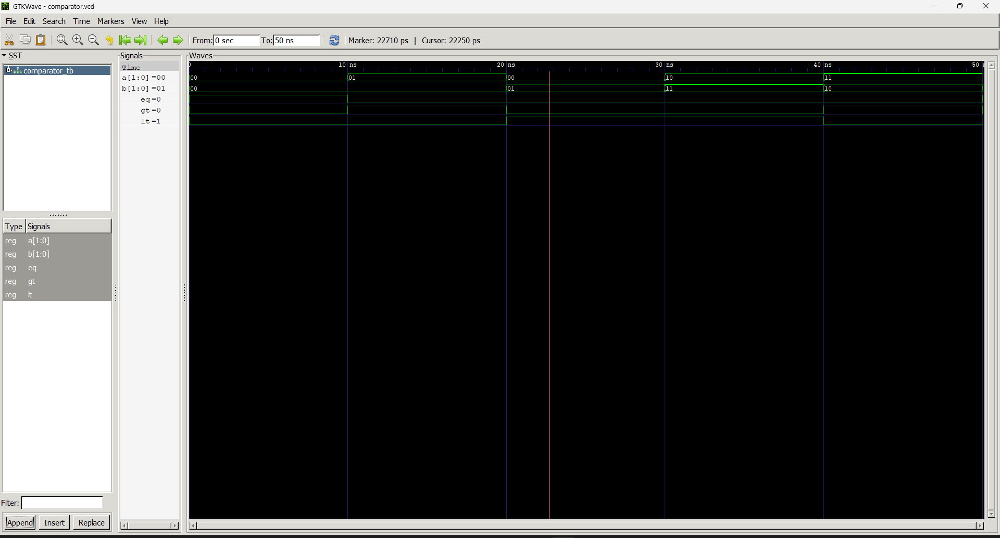

# Lab Report: 2-bit Magnitude Comparator

## Objective
* To design and simulate a 2-bit magnitude comparator in VHDL.
* To understand how comparison operations are implemented in hardware.

## Theory
A **magnitude comparator** compares two binary numbers and produces three output signals:

* **EQ** (*Equal*): HIGH when $A = B$
* **GT** (*Greater Than*): HIGH when $A > B$
* **LT** (*Less Than*): HIGH when $A < B$

For a 2-bit comparator with inputs $A = A_1A_0$ and $B = B_1B_0$:

$$
\text{EQ} = \overline{A_1 \oplus B_1} \cdot \overline{A_0 \oplus B_0}
$$

$$
\text{GT} = A_1\overline{B_1} + \overline{A_1 \oplus B_1} \cdot A_0\overline{B_0}
$$

$$
\text{LT} = \overline{A_1}B_1 + \overline{A_1 \oplus B_1} \cdot \overline{A_0}B_0
$$

# Output

# Discussion and conclusion
Here, by the waveform we verify that a comparator has place for 2 input and 3 output lines, the comparator is a device that compares the two inputs and gives an output as high in one of the 3 output lines. The two inputs A and B determine the output eq, lt and gt, eq = 1 when A=B, gt = 1 when A > B and lt = 1 when A < B.