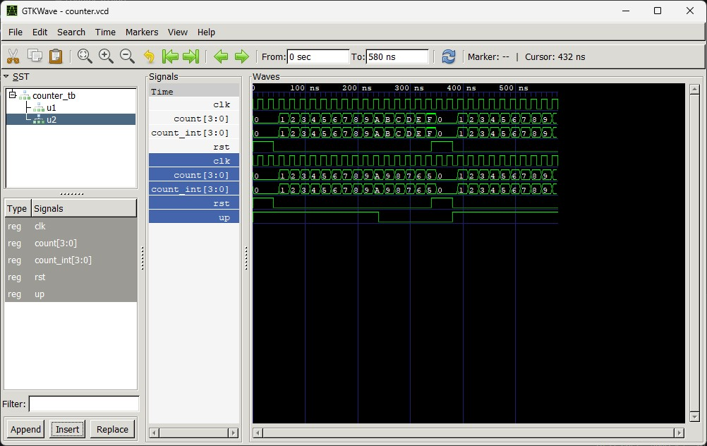

# Lab 8: VHDL Code for Sequential Circuits – Counters

---

## Objective
- To design and simulate a **4-bit synchronous up counter** in VHDL.  
- To design and simulate a **4-bit synchronous up/down counter** in VHDL.  
- To verify both counters together in a **single testbench**.  

---

## Theory
A **counter** is a sequential circuit that cycles through a predefined sequence of states on each clock edge.  
Counters are built from flip-flops and are fundamental to **timing, sequencing, and frequency division** in digital systems.

### Key Concepts
- **Synchronous Counter**: All flip-flops are clocked simultaneously, ensuring faster and more reliable operation compared to ripple (asynchronous) counters.  
- **Up Counter**: Increments the count by 1 on each clock edge.  
- **Up/Down Counter**: Increments or decrements based on a **direction control signal** (`UP`).  
- **Reset**: An active-high reset initializes the counter to zero, either synchronously or asynchronously.  

---

## Output
Simulation waveform showing both counters in the same testbench:  

---

## Discussion
- Both counters were instantiated in a **single testbench**, driven by the same clock and reset signals.  
- The **up counter** consistently incremented from `0000` to `1111` and rolled over.  
- The **up/down counter** incremented when `UP = 1` and decremented when `UP = 0`, demonstrating bidirectional counting.  
- Reset cleared both counters to `0000`, confirming proper initialization.  
- Running both counters side by side allowed direct comparison of their behavior under identical stimulus.  

---

## Conclusion
This lab demonstrated the design and simulation of **synchronous counters** in VHDL.  
Key takeaways:  
- The **up counter** provides straightforward incrementing behavior.  
- The **up/down counter** adds flexibility with a direction control signal.  
- A **single testbench** can effectively verify multiple designs in parallel, simplifying simulation and comparison.  

Counters remain essential building blocks in digital systems, forming the basis of **timers, frequency dividers, and control logic**.  
