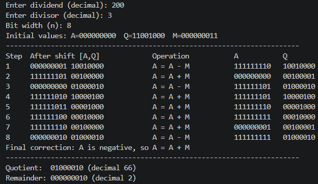

# Lab 10: Non-Restoring Division Algorithm

**Course:** Computer Architecture (CMP 262)
**Program:** Bachelor of Computer Engineering
**Semester:** Fourth Semester
**College:** Cosmos College of Management and Technology
**Department:** Department of Information and Communication Technology

---

## Objective

- To understand the concept of the non-restoring division algorithm.
- To implement unsigned binary division using Python.
- To verify the division process by observing the quotient and remainder.

---

## Theory

Non-restoring division is a fast and efficient method used to divide binary numbers without repeatedly restoring the partial remainder after each subtraction. In this method, the dividend is shifted and the divisor is either subtracted or added depending on the sign of the partial remainder.

The algorithm works as follows:

1. Initialize the accumulator $A$ to 0 and the quotient $Q$ to the dividend.
2. Shift the combined register $[A, Q]$ left by one bit.
3. If the accumulator is positive, subtract the divisor; otherwise, add the divisor.
4. Set the quotient bit based on the sign of the new accumulator value.
5. Repeat the process for each bit of the dividend.
6. Apply a final correction if the remainder is negative.

This method is commonly used in arithmetic logic units (ALUs) for hardware implementation of division.

---

## Program File

**Filename:** `non_restoring_division.py`

The Python program implements unsigned binary division using the non-restoring algorithm. It accepts a dividend and a divisor as input and prints the intermediate steps, final quotient, and remainder.

### Code Snippet

```python
def non_restoring_division(dividend: int, divisor: int, *, show_steps: bool = True) -> tuple[int, int]:
    """Divide two non-negative integers and return ``(quotient, remainder)``."""
    if dividend < 0 or divisor < 0:
        raise ValueError("This implementation accepts unsigned (non-negative) integers only.")
    if divisor == 0:
        raise ZeroDivisionError("Division by zero is not allowed.")

    n = max(1, dividend.bit_length(), divisor.bit_length())
    a_width = n + 1
    a = 0
    q = dividend
    m = divisor

    for step in range(1, n + 1):
        incoming_bit = (q >> (n - 1)) & 1
        a = (a << 1) | incoming_bit
        q = (q << 1) & ((1 << n) - 1)

        if a >= 0:
            a -= m
            operation = "A = A - M"
        else:
            a += m
            operation = "A = A + M"

        if a >= 0:
            q |= 1

    if a < 0:
        a += m

    return q, a
```

### Run the Program

```bash
python non_restoring_division.py
```

You can also run the built-in self-test:

```bash
python non_restoring_division.py --test
```

---

## Output

The program output was observed and the result was recorded.



**Observation:** The program successfully performed division using the non-restoring algorithm and produced the expected quotient and remainder for the given input.

---

## Discussion and Conclusion

This lab introduced the non-restoring division method, which is an important concept in computer arithmetic. The implementation helped in understanding how binary division is performed step by step using shifts and addition/subtraction operations. The Python simulation confirmed that the algorithm produces correct quotient and remainder values for unsigned integers.
