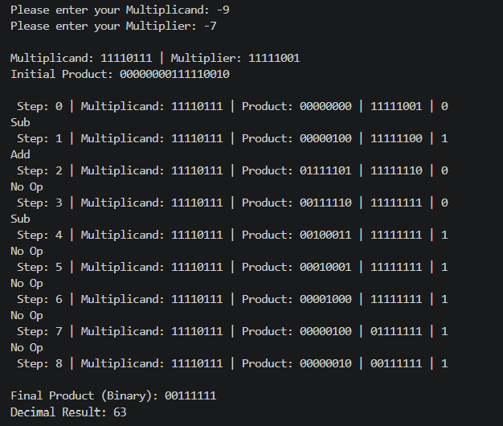

# Lab 9: Program to Implement the Booth Algorithm

**Course:** Computer Architecture (CMP 262)
**Program:** Bachelor of Computer Engineering
**Semester:** Fourth Semester
**College:** Cosmos College of Management and Technology
**Department:** Department of Information and Communication Technology

---

## Objective

- To understand the Booth multiplication algorithm for signed binary numbers.
- To implement the Booth algorithm and verify it with test cases.

---

## Theory

The **Booth Algorithm** (1951) is an efficient method for multiplying two signed integers in two's complement representation. It reduces the number of addition/subtraction operations by exploiting runs of consecutive 1s and 0s in the multiplier.

### Key Concepts

| Term | Description |
|------|-------------|
| **Two's Complement** | Standard representation for signed integers in binary form. |
| **Multiplicand (M)** | The number being multiplied. |
| **Multiplier (Q)** | The number multiplying the multiplicand. |
| **Accumulator (A)** | Stores partial results during multiplication. |
| **Arithmetic Right Shift** | Shift operation that preserves the sign bit (MSB). |

### Advantages of Booth Algorithm

1. **Reduces Operations:** Instead of adding for every 1 in the multiplier, it recognizes runs of consecutive 1s and performs fewer operations.
2. **Handles Signed Numbers:** Works directly with two's complement signed integers without conversion.
3. **Efficient:** Particularly effective for multipliers with long sequences of 1s or 0s.

---

## Algorithm

Given multiplicand M and multiplier Q, both n bits:

### Step-by-Step Process

1. **Initialize:** 
   - Accumulator A = 0
   - Q₋₁ = 0 (an extra bit)
   - step count = n

2. **Examine the last two bits of Q (Q₀ and Q₋₁):**
   
   | Q₀ | Q₋₁ | Operation |
   |----|-----|-----------|
   | 0 | 0 | No operation (shift only) |
   | 0 | 1 | A = A + M |
   | 1 | 0 | A = A − M |
   | 1 | 1 | No operation (shift only) |

3. **Perform Arithmetic Right Shift:** Shift the combined register [A, Q, Q₋₁] by 1 bit to the right.

4. **Repeat:** Execute steps 2-3 for n cycles (where n is the number of bits).

5. **Result:** The final product is in [A, Q] (the concatenation of A and Q).

### Example
```
Multiplicand (M) = 5 = 0000 0101
Multiplier (Q) = 3 = 0000 0011

Expected Result = 5 × 3 = 15 = 0000 1111
```

---

## Implementation Details

### Python Implementation: `booth.py`

The implementation includes the following functions:

#### Core Functions

- **`booths_algorithm()`** - Main function that handles user input and orchestrates the algorithm
- **`boothsTriumph(mcand, plier)`** - Parent function that executes the Booth algorithm logic
- **`perform_operation(product, mcand, operation)`** - Performs the required operation based on Q₀Q₋₁
- **`shift(product)`** - Performs arithmetic right shift on the register
- **`binAdd(num, num2)`** - Binary addition of two binary strings
- **`subtraction(product, mcand)`** - Binary subtraction with carry handling

#### Helper Functions

- **`convertDec(dec)`** - Converts decimal numbers to 8-bit binary
- **`twos_complement(dec)`** - Converts negative decimal numbers to two's complement binary
- **`flip(string)`** - Flips binary bits (0→1, 1→0)
- **`buildLine(iteration, mcand, product)`** - Formats output for step-by-step display
- **`getInput(varName)`** - Gets and validates user input (range: -128 to 127)

### Data Format

- **Word Size:** 8 bits per operand
- **Range:** -128 to 127 (two's complement signed integers)
- **Product Register:** 17 bits (8-bit A + 8-bit Q + 1-bit Q₋₁)

---

## Running the Program

### Prerequisites
- Python 3.x installed on your system

### Execution

```bash
python booth.py
```

or

```bash
python3 booth.py
```

### Code Snippet

```python
def boothsTriumph(mcand, plier):
    """Parent function for logical process"""
    product = "00000000" + plier + "0"
    print("Initial Product: " + product)

    for i in range(1, 9):
        operation = product[len(product) - 2:]
        product = perform_operation(product, mcand, operation)
        print(buildLine(i, mcand, product))

    product = shift(product)
    product = product[9:17]
    print("\nFinal Product (Binary): " + product)
    return product
```

### Example Session

```
Please enter your Multiplicand: 5
Please enter your Multiplier: 3

Multiplicand: 00000101 | Multiplier: 00000011
Initial Product: 000000000000001100

 Step: 0 | Multiplicand: 00000101 | Product: 00000000 | 00000011 | 0
 Step: 1 | Multiplicand: 00000101 | Product: 00000101 | 10000001 | 1
Add
 Step: 2 | Multiplicand: 00000101 | Product: 00000010 | 11000000 | 0
... (iterations continue)
 
Final Product (Binary): 00001111
Decimal Result: 15
```

---

## Test Cases

Test the implementation with these cases:

| Multiplicand | Multiplier | Expected Result | Notes |
|--------------|-----------|-----------------|-------|
| 5 | 3 | 15 | Simple positive case |
| 7 | 4 | 28 | Larger positive numbers |
| -5 | 3 | -15 | Negative multiplicand |
| 5 | -3 | -15 | Negative multiplier |
| -5 | -3 | 15 | Both negative |
| 0 | 5 | 0 | Zero multiplicand |
| 127 | 1 | 127 | Maximum positive value |
| -128 | 1 | -128 | Minimum value |

---

## Output 

---

## Discussion and Conclusion

The Booth Algorithm is a fundamental multiplication technique in computer architecture that efficiently multiplies signed binary numbers. This implementation demonstrates:

1. **Algorithm Correctness:** Properly handles all four operation cases based on bit patterns
2. **Two's Complement:** Correctly processes negative numbers in two's complement representation
3. **Binary Arithmetic:** Implements binary addition and subtraction from scratch
4. **Arithmetic Right Shift:** Preserves sign bit during shift operations

The step-by-step display helps visualize how the algorithm reduces the number of operations compared to traditional multiplication, making it an essential technique in digital computation and hardware design.

---

## References

- Booth, A. D. (1951). "A signed binary multiplication technique." *The Quarterly Journal of Mechanics and Applied Mathematics*, 4(2), 236-240.
- Hennessy, J. L., & Patterson, D. A. (2017). *Computer Architecture: A Quantitative Approach* (6th ed.). Morgan Kaufmann.
