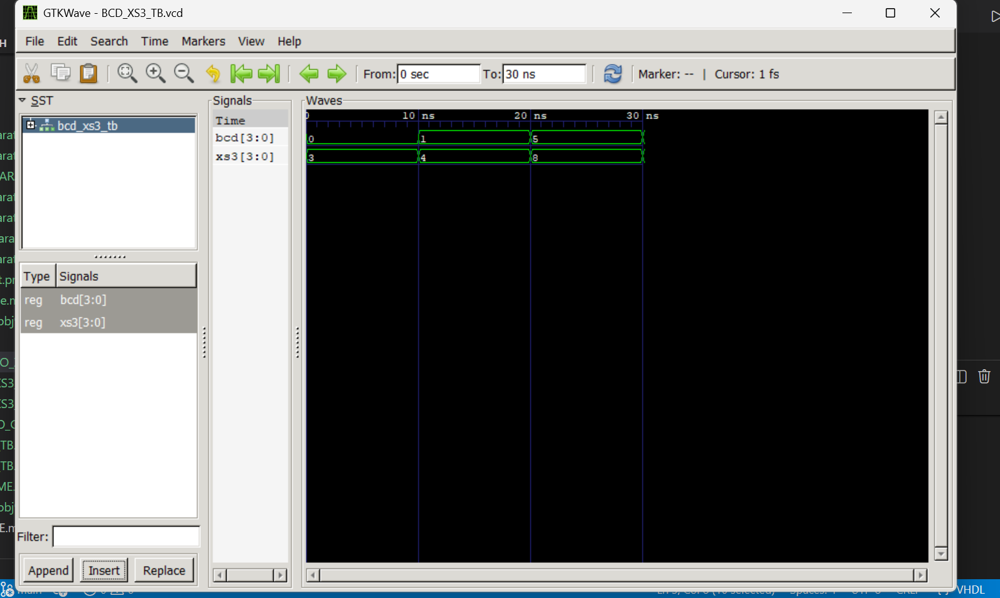
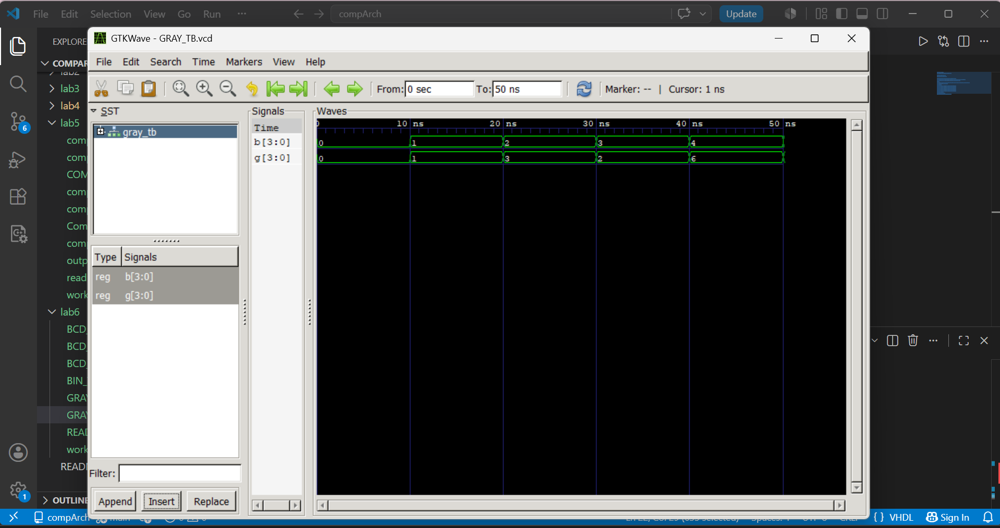

# Lab 6: VHDL Code for Combinational Circuits – Code Converter

## Objective
- To design and simulate a **BCD-to-Excess-3 code converter** in VHDL.  
- To design and simulate a **Binary-to-Gray code converter** in VHDL.  

## Theory

### BCD to Excess-3
- **Excess-3 (XS-3)** is a non-weighted BCD code obtained by adding **3 (0011)** to each BCD digit.  
- It is **self-complementing**, making it useful in arithmetic circuits.  

**Conversion Table:**

| Decimal | BCD (DCBA) | Excess-3 (WXYZ) |
|---------|------------|-----------------|
| 0       | 0000       | 0011            |
| 1       | 0001       | 0100            |
| 2       | 0010       | 0101            |
| 3       | 0011       | 0110            |
| 4       | 0100       | 0111            |
| 5       | 0101       | 1000            |
| 6       | 0110       | 1001            |
| 7       | 0111       | 1010            |
| 8       | 1000       | 1011            |
| 9       | 1001       | 1100            |

---

### Binary to Gray Code
- **Gray code** is a binary numeral system where **two successive values differ by only one bit**.  
- It is widely used in **rotary encoders** and for **error minimization**.  
- Conversion rule:  
  $$
   G_i = B_i \oplus B_{i+1}
  $$
(MSB of Gray = MSB of Binary)

---

## Output
**BCD TO XS3**

**Binary To Gray**

## Discussion
In this lab, we implemented two **combinational code converters** in VHDL:  
- The **BCD-to-Excess-3 converter** correctly added 3 to each BCD digit, producing the expected XS-3 outputs.  
- The **Binary-to-Gray converter** ensured that successive binary values differed by only one bit in Gray code.  
- Simulation waveforms confirmed the correctness of both designs.  
- These converters highlight how **simple arithmetic and logical operations** can be used to implement practical digital systems.  

## Conclusion
This lab demonstrated the design and simulation of **code converters** in VHDL.  
We learned how to:  
- Implement **BCD-to-Excess-3 conversion** using arithmetic addition.  
- Implement **Binary-to-Gray conversion** using XOR logic.  
- Verify outputs through simulation and waveform visualization.  

The experiment reinforced the importance of **code converters** in digital electronics, especially in **error detection, digital communication, and hardware design**.  