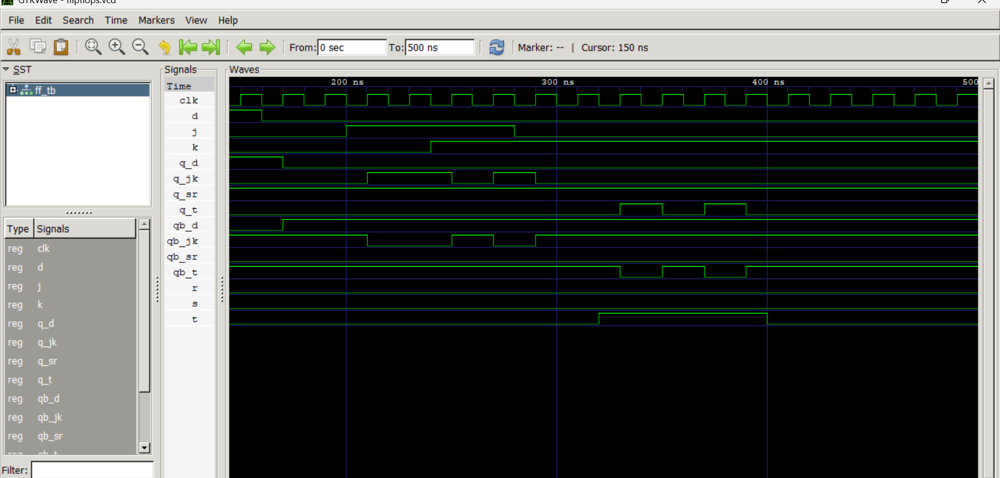

# Lab 7: VHDL Code for Sequential Circuits – Flip-Flops

## Objective
- To design and simulate **SR, D, JK, and T flip-flops** in VHDL.  
- To understand the role of the **clock signal** in sequential circuits.  

## Theory
A **flip-flop** is a bistable sequential element — it stores one bit of state.  
Unlike combinational circuits, its output depends on both the **current inputs** and its **previous state**.  
Flip-flops are triggered by a **clock signal**, either on the rising edge or falling edge.

### SR Flip-Flop
| S | R | Q(next) |
|---|---|---------|
| 0 | 0 | Q (no change) |
| 0 | 1 | 0 (reset) |
| 1 | 0 | 1 (set) |
| 1 | 1 | X (forbidden) |

---

### D Flip-Flop
- Captures the value of **D** on the clock edge.  
- Equation:  
  

\[
  Q_{next} = D
  \]

---

### JK Flip-Flop
- Eliminates the forbidden state of SR.  
- Behavior:  
  - When **J = K = 1**, the output toggles.  
- Equation:  
  

\[
  Q_{next} = J \cdot \overline{Q} + \overline{K} \cdot Q
  \]

---

### T Flip-Flop
- When **T = 1**, output toggles.  
- When **T = 0**, output holds.  
- Equation:  
  

\[
  Q_{next} = T \oplus Q
  \]

---

## Output

## Discussion
In this lab, we implemented **SR, D, JK, and T flip-flops** in VHDL.  
Key observations:  
- Each flip-flop responds to the **clock edge** and updates its state accordingly.  
- The **SR flip-flop** has a forbidden state when both inputs are 1.  
- The **D flip-flop** acts as a data latch, directly transferring input to output.  
- The **JK flip-flop** resolves the forbidden state and introduces toggling.  
- The **T flip-flop** simplifies toggling behavior.  
- Simulation results matched the expected truth tables, confirming correctness.  

## Conclusion
This lab demonstrated how **sequential circuits** are implemented in VHDL using flip-flops.  
We learned how to:  
- Define the behavior of different flip-flops.  
- Implement them in VHDL with clock sensitivity.  
- Verify their operation using simulation waveforms.  

The experiment reinforced the importance of **flip-flops** as fundamental building blocks in digital systems, forming the basis of **registers, counters, and memory elements**.  